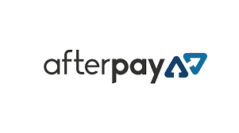

# Afterpay

## Afterpay - a FinTech Case study
Why is Afterpay such a finanical powerhouse within 7 years?

By James Sheridan
### Afterpay
Afterpay was founded by Anthony Eisen and Nicholas Molnar in 2014.
Molnar had the theory that "Millennials have a total aversion to credit cards, because they can lead to compounding debt."

He joined forces with Eisen to create Afterpay, which instead of making its profits through compound interest, charges retailers a 4-6% fee to provide their 'service'. Late fees are charged if the consumer misses payment, but they are limited to 25% of the purchase.

Afterpay keeps the system ‘simple’, by breaking the purchase up into 4 equal payments over a short period of time, with the first instalment due at the time of purchase.

Molnar had to found the company by taking it public in 2016, and raising $25 million on the open market due to a lack of private investment availability.
### Business Activities
Afterpay provides consumer credit directly to end consumers, by providing a link at the retailers checkout, and provides near instantaneous credit checks and approvals.

This allows retailers to sell products to customers who otherwise wouldn’t be able to pay for the product at the time and the retailer would lose the sale. This is different to traditional credit cards which give users a ‘line of credit’ that involves high fees and compounding high interest rates if not paid off within the month.

Afterpay has targeted mainly the younger ‘Millenial’ generation with its campaign, because they are tech savvy and more likely to connect with new financial products.  Afterpay has leveraged their ‘Millenial’ customer base and created ‘viral’ marketing campaigns to create an 'unfair advantage' in the market - one of their successful campaigns involved getting end consumers to bombard retailers with requests for Afterpay service to force retailers to provide Afterpay service. 

Afterpay uses hundreds of data points to analyse the application, including information such as whether the intended product is in high demand by fraudsters, and uses this to help in the credit application process and reduce the credit risk for Afterpay. This has managed to keep their defaulters down to less than 1% of purchase value.

Afterpay suprisingly only rely on their internal datasets to make a decision on a customers credit worthiness - despite a disclaimer they may refer to third party credit reporting bodies. This would hint at machine learning being used to develop credit ratings for customers based on products, purchasing patterns, and customer personal data.
### Landscape
Klarna, Zip Pay, Splitit, OpenPay and Sezzle are all direct competitors to Afterpay, and offer similar POS credit options. PayPal are about to start offering a similar service due to the rapid growth of this market sector (PayPal Credit).

According to 
https://www.mobindustry.net/buy-now-pay-later-bnpl-market-overview-trends-and-technologies/#:~:text=A%20recent%20report%20from%20IBISWorld,five%20years%20to%20%24%201.1%20billion.
The Buy Now Pay Later (BNPL) market is currently worth $741.5 million in sales for 2019-2020, and is expected to grow at 9.8% per annum for the following 5 years.

The BNPL market was fairly benign at around $100 million per annum from 2011-2016, and is now experiencing exponential growth as younger tech savvy consumers enter the market.
### Results
BNPL make their earnings from charging retailers a 4-6% charge on the sale, and charging interest and late fees on consumers if they miss payments. The advantage to the retailer is despite losing 4-5% of the sale to AfterPay, they receive the money unconditionally, and the credit risk falls to AfterPay.

Accordingly, it has been found that retailers that offer BNPL services generally increase their sale by 20-30%, the customers spend more due to credit availability and that BNPL users tend to use the products 20 times per year on average.

AfterPay is 3x larger than ZipPay by revenue in Australia at the moment ($356.6 million vs $110.6 million), and all the remainders are <$16 million each. SplitIt based in New York has $503.6 million pa revenue. AfterPay is clearly dominating the Australian BNPL scene for now.

### Recommendations
If I were advising AfterPay, I would suggest they get on board with utility bill providers and councils, to assist homeowners with meeting their obligations.

Klarna currently offers a ‘ghost’ credit card option for their customers to use with retailers that don’t offer that service, I would suggest AfterPay offers similar to compete.

I am sure AfterPay already possess the necessary technology to implement this, they would just need to find a way to determine what the customer was purchasing with said ‘ghost’ card to ensure it isn’t being used for fraud or illegal purposes – eg a screenshot of the shopping cart and some sort of AI character and language recognition.

### Conclusion
Afterpay are offering a unique and growing credit service, that is easily reached and used by younger customers. As events like the COVID-19 pandemic have proven, people need access to cheap and easy credit to tide them over during ‘lean’ times. By being treated fairly by AfterPay, the consumers have awarded them a large, growing customer base and steady revenue.
### References
https://en.wikipedia.org/wiki/Afterpay

https://www.mobindustry.net/buy-now-pay-later-bnpl-market-overview-trends-and-technologies/#:~:text=A%20recent%20report%20from%20IBISWorld,five%20years%20to%20%24%201.1%20billion.

https://www.owler.com/company/afterpaytouch

https://www.forbes.com/sites/jeffkauflin/2018/07/03/how-a-28-year-old-turned-layaway-for-millennials-into-a-2-billion-business/?sh=af2f67359dba

